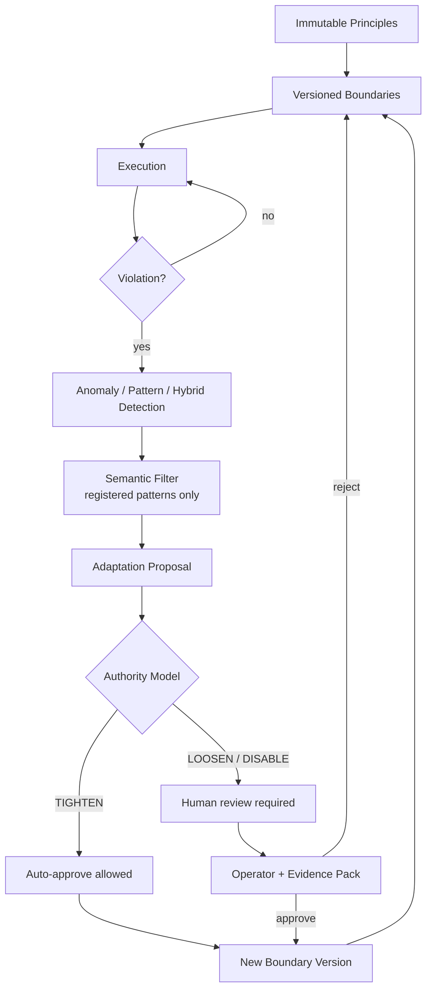
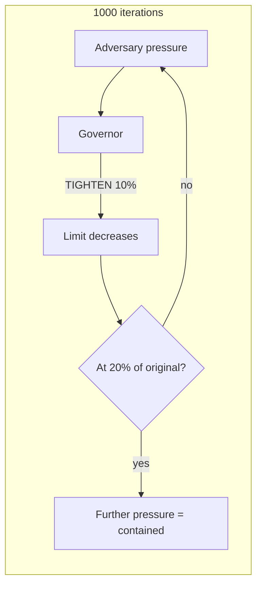
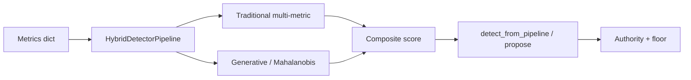

# Architecture Diagrams (Phase 12C)

Renderable as Mermaid in GitHub Markdown and most documentation tools.

## Figure 1 — System architecture and authority cut-point



## Figure 2 — Endurance under sustained pressure



Conceptual result from multi-seed endurance: min usability ≈ 20.6% of original; residual success rate ≈ 1% under floor-aware scoring.

## Figure 3 — Multi-seed metrics vs targets

```mermaid
barChart
  title Multi-seed means vs targets (schematic)
  x-axis FP Detection EnduranceSuccess MinUsability
  y-axis Value
```

See `results/multiseed_summary.md` for numeric tables (N=10).

## Figure 4 — Hybrid multi-metric dataflow


